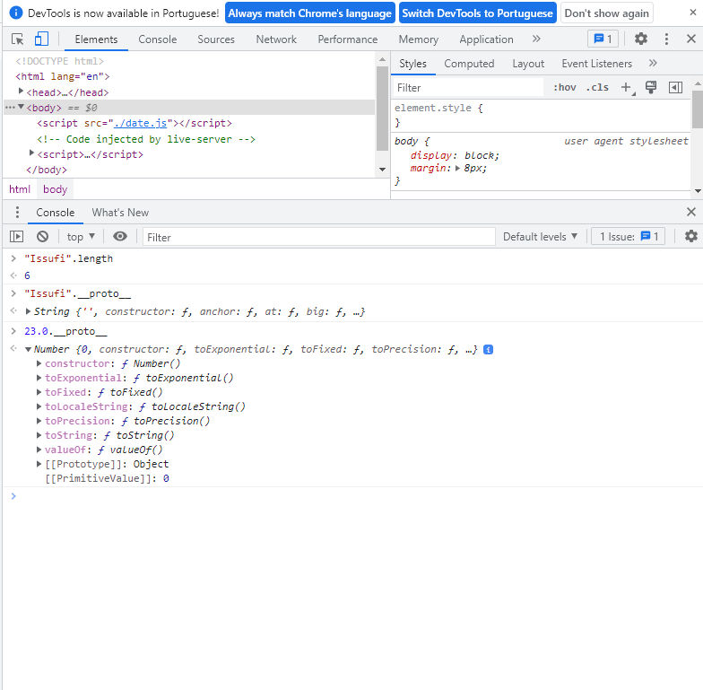

# **<font color=red>JavaScript - Anotações</font>**

Paginas da [Documentação de JS javascript.info](https://javascript.info/) | [Documentação de JS MDN](https://developer.mozilla.org/pt-BR/docs/Web/JavaScript) | [Documentação de JS devdocs.io](https://devdocs.io/javascript/) | [Documentação de JS nodeschool.io](https://nodeschool.io/pt-br/index.html#workshoppers)

## **<font color=green>O Guia Estelar de JavaScript</font>**

<!-- ❌✅✔️-->

### **1.✅Introdução**

**✔️Abertura**
Nesse curso vamos aprender sobre JavaScript, entender os tipos de dados, variáveis, funções, manipulação de dados, pra que precisamos de todos esses recursos, e mais.

**✔️JavaScript**

- Neste curso vamos falar sobre o JavaScript Core, que é o JavaScript puro, sem nenhum framework.
  - JavaScript é uma linguagem de programação que roda no navegador do usuário, e pode rodar no computador com algumas aplicações que serão citadas em seguida no curso.
  - podemos fazer alteração do site ou aplicativo, conforme a interação do usuário
  - Com o JavaScript podemos criar aplicações web, mobile com React Native, e desktop com Electron.
- Roda tambem no computador(Back-end).

**✔️O que podemos fazer com JavaScript**

- podemos criar aplicaçoes web, mobile(React Native), desktop(electron)
- As empresas famosa que usam
  - Facebook(inst, whatsapp)
  - google(Youtube, Gmail, Drive)
  - Uber
  - Netflix
  - TikTok
  - ...
  - 99,99% dos sites na web usam JavaScript
  - Linguagem obrigatória para quem programa front-end web
  <hr>

### **2.✅Primeiros Passos**

**✔️Sintaxe**

Nesta aula vamos entender melhor a sintaxe, que é o jeito de escrever código para ele ser entendido pela máquina, que todas as linguagens tem e que engloba 82% dos erros de iniciantes em programação.

```js
console.log("Bem vindos ao Starter")
```

Resumo
Cobrimos 3 funções específicas do navegador para interagir com os visitantes:

`alert`
mostra uma mensagem.

```js
alert(`You are ${age} years old!`) // You are 100 years old!
```

`prompt`
mostra uma mensagem pedindo ao usuário para inserir texto. Retorna o texto ou, se o botão Cancelar ou Escfor clicado, null.

```js
let age = prompt("How old are you?", 100)
```

`confirm`
mostra uma mensagem e espera que o usuário pressione “OK” ou “Cancelar”. Retorna truepara OK e falsepara Cancel/ Esc.

```js
let isBoss = confirm("Are you the boss?")

alert(isBoss) // true if OK is pressed
```

Todos esses métodos são modais: eles pausam a execução do script e não permitem que o visitante interaja com o restante da página até que a janela seja descartada.

Existem duas limitações compartilhadas por todos os métodos acima:

A localização exata da janela modal é determinada pelo navegador. Normalmente, fica no centro.
A aparência exata da janela também depende do navegador. Não podemos modificá-lo.
Esse é o preço da simplicidade. Existem outras maneiras de mostrar janelas mais agradáveis ​​e interação mais rica com o visitante, mas se “sinos e assobios” não importam muito, esses métodos funcionam bem.

[alert-prompt-confirm](https://javascript.info/alert-prompt-confirm)

**✔️Maneiras de executar o JavaScript**

Nesta aula vamos citar 3 maneiras de executar códigos em JavaScript, a primeira maneira é pelo navegador, clicando na tecla F12 em qualquer website o menu do DevTools, que são ferramentas para desenvolvedores, na aba console podemos executar código JavaScript. A segunda forma é pela aplicação web CodePen, abrindo o endereço codepen.io/pen você encontra um ambiente que se pode utilizar codigo HTML, CSS e JavaScript. Também pode-se usar o Visual Studio Code, criando um arquivo HTML com a tag <script> e colocando o código dentro.

```html
<script>
  console.log("Bem vindo ao stater")
</script>
```

**✔️Adicionando arquivos JS**

Uma outra maneira de organizar o código JavaScript é criando um arquivo com um final ".js" no diretório junto ao arquivo HTML, de preferência evitando usar caracteres especiais como letras acentuadas e espaços. Para conectar este arquivo JS ao HTML, pode-se usar a linha de código <script src="./nomedoarquivo.js"></script> no body, agora abrindo este arquivo HTML o código será executado.

```html
<!DOCTYPE html>
<html lang="en">
  <head>
    <meta charset="UTF-8" />
    <meta http-equiv="X-UA-Compatible" content="IE=edge" />
    <meta name="viewport" content="width=device-width, initial-scale=1.0" />
    <title>Document</title>
  </head>

  <body>
    <script src="./script.js"></script>
  </body>
</html>
```

**✔️Comentários**

Para comentar seu código no Javascript, pode se usar // antes da linha, para definir aquela linha inteira, para comentar mais de uma linha, pode se usar um /_ no começo do comentário e um _/ no final. Comentários não são executados, mas são mostrados para quem visualiza o código.

```js
//comentarios em linha
/*comentarios de varias linhas  */
```

<hr>

### **3.✅Tipos de dados**

[Standard built-in objects](https://developer.mozilla.org/en-US/docs/Web/JavaScript/Reference/Global_Objects)

**✔️Introdução**

Para entendermos mais sobre os tipos de dados, podemos compará-los com elementos da gramática, para aprendermos precisamos saber como escrever, os significados e continuar aprendendo para expandir nosso vocabulário. A dinâmica do aprendizado nesse módulo vai consistir em conceitos e escrita, deixando a aplicação para um outro momento, vamos aprender os tipos de dados mais utilizados.

**✔️String**
O tipo de dados String consiste em uma cadeia de caracteres, ou seja, textos. Para denotar string no JavaScript são usados aspas duplas ( " " ), aspas simples ( ' ' ) e template literals ou template strings ( ), template literals permitem textos multilinhas e expressões de linguagem com os caracteres ${ }, por exemplo: console.log(A soma de duas unidades é ${1+1}), já as outras não, por exemplo: console.log("Isso é um texto").

```js
//string
console.log("Issufi")
alert("Issufi")
console.log("Badji")
//soma
console.log(1 + 2)

//interpolação
console.log(`soma de ${1 + 2}`)
```

**✔️Number**

No JavaScript temos 4 tipos de números, os inteiros (por exemplo: 13), os reais ou float (por exemplo: 83.1), o Not a Number (NaN) e o infinito (Infinity).

```js
//number int
console.log(33)
//soma de int
console.log(12 + 13)
//divisão d float
console.log(12.5 / 12)
//impossivel
console.log(12.5 / "issufi") // NaN
alert("not a number" / 2) // NaN, such division is erroneous
//Infinity(false/true)
console.log(12.5 === Infinity)
//Infinity
console.log(Infinity)
alert(Infinity) // Infinity
```

**✔️Boolean**
No JavaScript, um dado boolean pode ter apenas 2 valores, verdadeiro (true) e falso (false).

```js
//true==>verdadeiro
console.log(true)
alert(true)
//false==>falso
console.log(false)
alert(false)
```

**✔️Undefined vs null**
No JavaScript temos o tipo de dados Undefined, que representa valores indefinidos, e o tipo de dados null, que são muitas vezes confundidos. A diferença dos dois é que null é considerado como um objeto vazio, ou seja, algo indefinido não existe, já algo null existe mas não tem valor algum.

```js
//indefinido
console.log(undefined)
//objeto sem nada
console.log(null)
//null é igual a undefined= false
console.log(null === undefined) //false
```

**✔️Object**

- O tipo de dado Object é estrutural, contendo atributos, ou propriedades, e métodos, ou funcionalidades.
- Em contraste, os objetos são usados ​​para armazenar coleções de dados e entidades mais complexas.
- Um objeto é denotado com os caracteres `{ }`, atributos e métodos com nome: valor . Por exemplo `{ nome: "João", idade: 20 }. `

* Saiba mais [objeto](https://javascript.info/object)

```js
//Objeto
//{ Prototype: Object }
console.log({
  nome: "Issufi",
  Sobrenome: "Badji",
  idade: `${50} anos`,
  ocupacao: "Estudante",
  andar: function () {
    console.log("andar")
  },
})
```

**✔️Array**
O tipo de dados Array, ou vetor, também é estrutural, e consiste em uma lista de dados agrupados, um Array é denotado com os caracteres [ ] , por exemplo:` [ "Leite", "Ovos", "Manteiga", 1, 2 ]` . Mais [array](https://javascript.info/array)

```js
//array
console.log(["Leite", "Ovos", 2, 5])
```

**✔️Conclusã**

- Conforme o ECMAScript Standard (o padrão do orgão que padroniza o JavaScript) temos 9 tipos de dados organizados em 4 categorias:
  - Primitive,
  - Primitive Value,
  - Structural e Structural Primitive.
- Os primitivos são:`String, Number, Boolean, Undefined, Symbol, BigInt`.
  Os estruturais são: `Object e Function`. Além destes, temos o primitivo estrutural que consiste apenas no dado `null`

```js

```

<hr>

### **4.✅Variáveis**

Abertura
Descrição
Nesse curso vamos aprender sobre JavaScript, entender os tipos de dados, variáveis, funções, manipulação de dados, pra que precisamos de todos esses recursos, e mais.
**Conhecendo as variáveis**
Descrição
Para entender variáveis podemos pensar nelas como nomes simbólicos para algum valor, atalhos de código ou identificadores. Para criar uma variável, podemos usar uma das palavras reservadas: `var, let e const`, por exemplo: `var clima = "quente"`, onde `var` é a palavra que simboliza a criação da variável, clima é o nome da variável, o sinal de igual denota que a variável está recebendo um valor e "quente" é a string que está sendo recebida. As variáveis declaradas com "var" e "let" podem ter seu valor mudado, já a const não.

**Variáveis**
Na maioria das vezes, um aplicativo JavaScript precisa trabalhar com informações. Aqui estão dois exemplos:

Uma loja online – as informações podem incluir mercadorias sendo vendidas e um carrinho de compras.
Um aplicativo de bate-papo – as informações podem incluir usuários, mensagens e muito mais.
Variáveis ​​são usadas para armazenar essas informações.

Uma variável
Uma variável é um “armazenamento nomeado” para dados. Podemos usar variáveis ​​para armazenar guloseimas, visitantes e outros dados.

Para criar uma variável em JavaScript, use a palavra- `let` chave.

A instrução abaixo cria (em outras palavras: declara ) uma variável com o nome “message”, em seguida Agora, podemos colocar alguns dados nele usando o operador de atribuição =:

```js
let message

message = "Hello" // store the string 'Hello' in the variable named message
```

Para ser conciso, podemos combinar a declaração e a atribuição da variável em uma única linha:

```js
let message = "Hello!" // define the variable and assign the value

alert(message) // Hello!
```

Também podemos declarar várias variáveis ​​em uma linha:

```js
let user = "John",
  age = 25,
  message = "Hello"
```

Isso pode parecer mais curto, mas não recomendamos. Para melhor legibilidade, use uma única linha por variável.

A variante de várias linhas é um pouco mais longa, mas mais fácil de ler:

```js
let user = "John"
let age = 25
let message = "Hello"
```

_var_ ao invés de _let_
Em scripts mais antigos, você também pode encontrar outra palavra-chave: _var_ em vez de _let_:

```js
var message = "Hello"
```

A varpalavra-chave é quase a mesma que let. Ele também declara uma variável, mas de uma maneira um pouco diferente, “old-school”.

Existem diferenças sutis entre lete var, mas elas ainda não importam para nós. Vamos abordá-los em detalhes no capítulo _O velho "var"_.

**Uma analogia da vida real**
Podemos entender facilmente o conceito de “variável” se a imaginarmos como uma “caixa” de dados, com um adesivo com um nome exclusivo.

Por exemplo, a variável messagepode ser imaginada como uma caixa rotulada "message"com o valor "Hello!"nela:

Podemos colocar qualquer valor na caixa.

Também podemos alterá-lo quantas vezes quisermos:

```js
let message

message = "Hello!"

message = "World!" // value changed

alert(message)
```

Quando o valor é alterado, os dados antigos são removidos da variável:

Também podemos declarar duas variáveis ​​e copiar dados de uma para a outra.

```js
let hello = "Hello world!"
let message

// copy 'Hello world' from hello into message
message = hello

// now two variables hold the same data
alert(hello) // Hello world!
alert(message) // Hello world
```

ou

```js
//var clima = "quente"//muda o seu valor durante aplicação
//let clima = "quente"//muda o seu valor durante aplicação
//clima = "frio"
const clima = "quente" //não muda o seu valor durante aplicação

console.log(clima)
```

**Declarar duas vezes aciona um erro**
Uma variável deve ser declarada apenas uma vez.
Uma declaração repetida da mesma variável é um erro:

```js
let message = "This"

// repeated 'let' leads to an error
let message = "That" // SyntaxError: 'message' has already been declared
```

Portanto, devemos declarar uma variável uma vez e depois nos referir a ela sem let.
<h>
**Resumo**
Podemos declarar variáveis ​​para armazenar dados usando as palavras-chave `var`, `let` ou `const`.

`let`– é uma declaração de variável moderna.
`var`– é uma declaração de variável antiga. Normalmente não o usamos, mas abordaremos diferenças sutis letno capítulo O antigo "`var`" , caso você precise deles.
`const`– é como `let`, mas o valor da variável não pode ser alterado.
As variáveis ​​devem ser nomeadas de uma forma que nos permita entender facilmente o que está dentro delas.

**Tarefa**
Trabalhando com variáveis

1.Declare duas variáveis: admine name.
2.Atribua o valor "John"a name.
3.Copie o valor de namepara admin.
4.Mostre o valor de adminusing alert(deve produzir "John").
solução:

```js
//No código abaixo, cada linha corresponde ao item na lista de tarefas.
let admin, name // can declare two variables at once
name = "John"
admin = name
alert(admin) // "John"
```

[variavel](https://javascript.info/variables)

**Tipos dinâmicos**
Descrição
O JavaScript é uma linguagem fracamente tipada e dinâmica, ou seja, ao declarar uma variável não é necessário estabelecer um tipo específico e o tipo do valor da variável pode mudar conforme o código.

```js

```

**Scope e var**

```js

```

**Scope let e const**

```js

```

**Nomeando variáveis**

```js

```

Resumo
Existem 8 tipos de dados básicos em JavaScript.

Sete tipos de dados primitivos:
`number` para números de qualquer tipo: inteiro ou ponto flutuante, os inteiros são limitados por .±(253-1)
`bigint` para números inteiros de comprimento arbitrário.
`string` para cordas. Uma string pode ter zero ou mais caracteres, não há um tipo de caractere único separado.
`boolean` para true/ false.
`null` para valores desconhecidos – um tipo autônomo que tem um único valor null.
`undefined` para valores não atribuídos – um tipo autônomo que tem um único valor undefined.
`symbol` para identificadores exclusivos.
E um tipo de dados não primitivo:
`object` para estruturas de dados mais complexas.
O `typeofo` perador nos permite ver qual tipo está armazenado em uma variável.

Geralmente usado como `typeof x`, mas `typeof(x)` também é possível.
Retorna uma string com o nome do tipo, como "string".
Para `null` retornos "object"– isso é um erro na linguagem, não é realmente um objeto.
**Tarefas**
Aspas de string

Qual é a saída do script?

```js
let name = "Ilya"

alert(`hello ${1}`) // ?

alert(`hello ${"name"}`) // ?

alert(`hello ${name}`) // ?
```

solucção

```js
//Backticks incorporam a expressão dentro ${...}da string.
let name = "Ilya"

// the expression is a number 1
alert(`hello ${1}`) // hello 1

// the expression is a string "name"
alert(`hello ${"name"}`) // hello name

// the expression is a variable, embed it
alert(`hello ${name}`) // hello Ilya
```

<hr>

### **5.✅Praticando e avançando**

**Declaration assignment var**

```js

```

**Agrupando declarações**

```js

```

**Concatenando e interpolando variáveis**

```js

```

**Objects**
Objects
Descrição
Para criarmos um objeto utilizamos as chaves envolvendo as propriedades, que são atribuídas com dois pontos, por exemplo: const person = { name: 'John', age: 20 }, para acessar essas propriedades usamos o ".", por exemplo: console.log(person.name).

```js
const person = {
  name: "John",
  age: 30,
  weight: 88.6,
  isAdmin: true,
}
console.log(person)
console.log(person.name)
console.log(person.age)
console.log(`${person.name} tem ${person.age} anos`)
```

**Arrays**
Arrays
Descrição
Para criarmos um vetor utilizamos [ ] envolvendo os valores, por exemplo: const animals = [ "Lion", "Monkey" ], para acessar esses valores usamos a posição do valor no vetor, começando por 0, por exemplo: console.log(animals[0]). Para descobrirmos o número de posições de um vetor qualquer, podemos utilizar a propriedade length, por exemplo: animals.length.

```js
const animals = [
  "Lion",
  "Monkey",
  {
    name: "Cat",
    age: 30,
  },
]

//Como acessar valor de um array
console.log(animals) //Lion, Monkey,Cat
console.log(animals[2]) //cat
console.log(animals.length) //3
console.log(animals[2].name) //Cat
console.log(`${animals[2].name} tem ${animals[2].age} anos`) //Cat tem 30 anos
```

**Exercícios**

```js
//1.Declara uma variavel de nome weight
//let weight
//2.Que tipo de dados é a variavel cima
//console.log(typeof weight)
/*
          3.Declara uma variavel e atribua valores para um dos dados
            * name: String
            * age:number(integer)
            * starts: Number(float)
            * isSubcribed: Boolean
        */
//let name = "Issufi"
//let age = 20
//let starts = 2.3
//let isSubcribed = true

/*
 *   4.A variável student abaixo é de que tipo de dados?
 * 4.1 Atribua a ela as mesmas propriedades e valores do exercício 3.
 * 4.2Mostre no console a seguinte mensagem:
 * <name> de idade <age>pesa<weight>kg
 * Atenção, substitua <name><age> e <weight>pelos valores de cada propriedade do objeto
 */

let student = {
  name: "issufi",
  age: 20,
  weight: 17.5,
}
//console.log(`${student.name} tem ${student.age} anos e ${student.weight} kg`)

/*
5.Declara uma variavel do tipo arary, de nome students e atibua a ela nenhhum valor, ou seja, somente o rarry vazio
*/

//let students = []

/* 
6.Reatibua valor para a variavel acima, colocando dentro dela o objeto student da questão 4(Não copia e colocar o objet, mas usar o objeto criado e inserir ele no array)
*/
students = [student]

//console.log(students)

/*
7.cologque no console o valor da posição zero array acima */
//console.log(students[0])

/*
8.Crie um novo student e coloque na posição 1 do arry students
*/
const John = {
  name: "Jhon",
  age: 23,
  weight: 45.5,
  isSubscribe: true,
}

//students = [student, John]
students[1] = John
console.log(students)
```

<hr>

### **6.❌Funções**

<hr>

### **7.❌Manipulando dados**

**Prototype**

O JavaScript possui uma característica chamada Prototype, que é uma série de funcionalidades e atributos que já existem nativamente em diversos tipos de dados, que são lidados como objetos.


```js
"Issufi".length
6
"Issufi".__proto__
String {'', constructor: ƒ, anchor: ƒ, at: ƒ, big: ƒ, …}anchor: ƒ anchor()at: ƒ at()big: ƒ big()length: 0name: "big"arguments: (...)caller: (...)[[Prototype]]: ƒ ()[[Scopes]]: Scopes[0]blink: ƒ blink()bold: ƒ bold()charAt: ƒ charAt()charCodeAt: ƒ charCodeAt()codePointAt: ƒ codePointAt()concat: ƒ concat()constructor: ƒ String()endsWith: ƒ endsWith()fixed: ƒ fixed()fontcolor: ƒ fontcolor()fontsize: ƒ fontsize()includes: ƒ includes()indexOf: ƒ indexOf()italics: ƒ italics()lastIndexOf: ƒ lastIndexOf()length: 0link: ƒ link()localeCompare: ƒ localeCompare()match: ƒ match()matchAll: ƒ matchAll()normalize: ƒ normalize()padEnd: ƒ padEnd()padStart: ƒ padStart()repeat: ƒ repeat()replace: ƒ replace()replaceAll: ƒ replaceAll()search: ƒ search()slice: ƒ slice()small: ƒ small()split: ƒ split()startsWith: ƒ startsWith()strike: ƒ strike()sub: ƒ sub()substr: ƒ substr()substring: ƒ substring()sup: ƒ sup()toLocaleLowerCase: ƒ toLocaleLowerCase()toLocaleUpperCase: ƒ toLocaleUpperCase()toLowerCase: ƒ toLowerCase()toString: ƒ toString()toUpperCase: ƒ toUpperCase()trim: ƒ trim()trimEnd: ƒ trimEnd()trimLeft: ƒ trimStart()trimRight: ƒ trimEnd()trimStart: ƒ trimStart()valueOf: ƒ valueOf()Symbol(Symbol.iterator): ƒ [Symbol.iterator]()[[Prototype]]: Objectconstructor: ƒ Object()hasOwnProperty: ƒ hasOwnProperty()isPrototypeOf: ƒ isPrototypeOf()propertyIsEnumerable: ƒ propertyIsEnumerable()toLocaleString: ƒ toLocaleString()toString: ƒ toString()valueOf: ƒ valueOf()__defineGetter__: ƒ __defineGetter__()__defineSetter__: ƒ __defineSetter__()__lookupGetter__: ƒ __lookupGetter__()__lookupSetter__: ƒ __lookupSetter__()__proto__: (...)get __proto__: ƒ __proto__()set __proto__: ƒ __proto__()[[PrimitiveValue]]: ""
23.0.__proto__
Number {0, constructor: ƒ, toExponential: ƒ, toFixed: ƒ, toPrecision: ƒ, …}
```

**Type conversion**

Type conversion se trata de uma conversão de tipo feita pelo dev, explicitamente, e pode ser feita de diversas maneiras, por exemplo com o método Number(), já type coersion é uma mudança de tipos feita pelo próprio JavaScript, implicitamente, por exemplo quando você tenta somar um número na forma string com um número do tipo número.

```js
console.log(Number("9") + 5) //14
```

**Strings em números**

É possível transformar números em formato de string através do método Number() e números em formato number em string usando o método String().

```js
//transformação de string para number
let string = "123"
console.log(Number(string)) //123

//transformação de number para
let number = 321
console.log(String(number)) //321
```

**Contando caracteres e digitos**
Para contar a quantidade de caracteres em uma string é possível usar o método length(), também é possível contar a quantidade de algarismos em um número transformando o número em string e usando o mesmo método.

```js
let word = "issufibadji"
console.log(word.length) //11

let number = 123456
console.log(String(number).length) //6
```

**Casas decimais**
Para determinar uma quantia de casas decimais de um número pode-se usar o método toFixed() colocando como argumento quantas casas decimais o número terá. Para mudar a formatação do número de separado por ponto para separado por vírgula é possível usar o método replace(".", ","). O resultado final será do tipo string, e a conversão para o tipo número não será possível por que a vírgula não é considerada parte de um número.

```js
let number = 345.465827
console.log(number.toFixed(2)) //234.47

//trcar ponto por virgula
let number = 345.465827
console.log(number.toFixed(2).replace(".", ",")) //234,47
```

**Maiúsculas e minúsculas**
Para transformar uma string em letras maiúsculas pode-se usar o método toUpperCase(), e ao contrário, também é possível usar o toLowerCase() para transformar uma string em todas letras minúsculas.

```js
let word = "Issufi Badji"
console.log(word.toLowerCase())
//
let word = "Issufi Badji"
console.log(word.toUpperCase())
```

**Separando strings**
Para separar um texto por espaços, pode-se usar o método split(" "), que transforma o texto em um array de strings baseado no argumento, que no caso são os espaços. Para juntar esse array é possível usar o método join('"), que juntaria essas palavras sem nenhum separador, porém colocando um argumento, no caso um underscore ( join("\_") ) as palavras são juntadas com o argumento de separador.

```js
let phrase = "Te amo muito"
let myArray = phrase.split(" ") //split("o")
console.log(myArray) //(3) ['Te', 'amo', 'muito']

///
let phrase = "Te Amo muito"
let myArray = phrase.split(" ") //split("o")
//console.log(myArray) //(3) ['Te', 'amo', 'muito']

let phraseWithUnderscore = myArray.join("_") //.join("")
console.log(phraseWithUnderscore.toLowerCase()) // te_amo_muito
```

**Encontrando palavras em frases**
Para verificar se um texto possui uma palavra específica, podemos usar o método includes(), passando como argumento a palavra a ser verificada, que retorna um valor true se encontrar a palavra, e falso se não, lembrando sempre que o método é case sensitive.

```js
let phrase = "Te Amo muito"

console.log(phrase.includes("Amo")) //true
```

**Criando array com construtor**
Para criar um array com um método construtor, usa-se new Array(args), passando como argumento o tamanho deste vetor ou os valores, por exemplo: const array = new Array("a", "b", "c").

```js
let myArray = new Array("a", "b", "c")
console.log(myArray) //["a", "b", "c"]
```

**Elementos do Array**
Para contar a quantidade de elementos em um array pode-se usar o método length.

```js
console.log(["a", "b", "c"].length) //3
```

**Strings para arrays**
Para transformar uma string em um array, pode-se usar o objeto Array com o método from(), passando como argumento a string a ser transformada em array. Por exemplo console.log(Array.from("developer").

```js
let word = "manipulação"
console.log(Array.from(word)) //
```

**Manipulando arrays**
Existem várias maneiras de manipular arrays, como: o método push(), que adiciona um elemento no final do array, o método unshift(), que adiciona um elemento no começo do array, o método pop(), que retira um elemento do final do array, o método shift(), que retira um elemento do começo do array, o método slice(), que recebe como argumentos a posição de início e a posição do fim da parte que você quer selecionar, e retorna os valores destas posições, o método splice(), que recebe como argumentos a posição de início e a quantidade de elementos que você quer remover e o método indexOff(), que encontra o index do valor que recebe como argumento em um array.

```js
let tech = ["html", "css", "js"]
// Adicionar um item no fim
tech.push("node.js") //["html", "css", "j","node.js"]
//Adcionar um item no começo
tech.unshift("jQuery") //[,"jQuery","html", "css", "j","node.js"]
//Reomover no inicio
tech.shift() //["html", "css", "j","node.js"]
//Reomover no fim
tech.pop() //["html", "css", "j"]
//pegar somente alguns elementos do array
console.log(tech.slice(1, 2)) //['css]
//remover 1 ou mais items em qualquer posição do Array
tech.splice(1, 2) //['html']
//encontrar a posição de um elemento no
let index = tech.indexOf("html")
console.log(index)
//
console.log(tech)
```

<hr>

### **8.❌Expressões e Operadores**

**Expressões e operadores**
Nas próximas aulas, falaremos sobre expressões e operadores.

Expresssões são bem tranquilas, porque expressões são qualquer linha de código que resolve alguma coisa no JavaScript, um exemplo é a expressão:

```js
let number
```

Isso é uma expressão, já que estamos declarando uma váriavel, nesse caso com o valor de undefined.

Toda expressão do Javascript pode ou não terminar com ; (ponto e vírgula), o final de uma expressão é facultativa, mas em algumas outras linguagens é obrigatório o uso de ; (ponto e vírgula).

Em alguns casos é necessário o uso de ; (ponto e vírgula), como numa função auto-executável, é um dos poucos casos onde faz falta, e é em um cenário como o seguinte:

```js
let number = 1(function () {
  console.log("alo")
})()
```

Caso você tente executar esse código, ele vai tentar atribuir essa função ao valor 1, onde o Javascript vai tentar executar o 1, passar uma função como argumento, e o 1 vai receber uma outra função. Um dos pouquíssimos casos onde o ; (ponto e vírgula) faz falta.

Veremos também sobre operadores, nesse exemplo temos o binário, unário e ternário.

```js
/* unário */
let number = 1

console.log(++number)
```

```js
/* binário */
let number = 1

console.log(number + 1)
```

```js
/* ternário */
console.log(true ? "alo" : "nada")
```

Como você pode observar, temos no unário um elemento, no binário dois elementos e no ternário três elementos.

**New**
A expressão new, também denominada como left-hand-side expression, serve para criar um novo objeto usando as funções construtoras que temos por padrão no JavaScript.

Um exemplo de seu uso é:

```js
let date = new Date('2020-12-01')
console.log(date.**proto**)
```

**Typeof delete**
Em operadores unários, os mais comuns são o typeof e o delete, onde o typeof serve para saber o tipo de dado que temos na expressão, e o delete vai deletar alguma propriedade de um objeto, desde que ela exista.

Exemplos de uso:

```js
;/_ delete _/
const person = {
  name: "Mayk",
  age: 25,
}
delete person.age

console.log(person)
```

Nesse caso estamos deletando a propriedade age do objeto person.

console.log(tyepof "mayk")
Aqui vemos qual o tipo de dado que temos, nesse caso uma string.

**Operadores aritméticos**
Falaremos nessa aula sobre operadores aritméticos, que nos possibilitam fazer cálculos matemáticos.

O operador de multiplicação é o \* (asterisco);

O operador de divisão é a / (barra);

O operador de soma é o + (positivo);

O operador de subtração é o - (negativo).

Outros operadores aritméticos incluem o resto de divisão, incremento, decremento e exponencial, com exemplos a seguir:

/_ resto da divisão: sinal % _/

```js
let remainder
remainder = 11 % 9
console.log(remainder)
```

/_ incremento: sinal ++ _/

```js
let increment = 0

console.log(++increment)
console.log(increment)
```

/_ decremento: sinal -- _/

```js
let decrement = 0
decrement--
console.log(decrement)
```

/_ exponencial: sinal \*\* _/

```js
console.log(2 \*\* 3)
```

**Grouping operator**
Vamos falar sobre um operador que agrupa expressões, os parênteses.

Na matemática, temos uma noção de precedência, onde certos operadores têm de ser realizados primeiro, e não é diferente para um computador, porém, podemos utilizar os parênteses para realizar o agrupamento de alguns operadores, que moverá a precedência do cálculo.

```js
let total = 2 + 3 \* 5
console.log(total)

//com essa precedência, nosso resultado é 17.
```

```js
let total = (2 + 3) \* 5
console.log(total)
// o cálculo mudou a precedência, fazendo nosso resultado tornar-se 25.
```

**Operadores de comparação igual a e diferente de**
02:01

**Operadores de comparação estritamente igual e estritamente diferente**
02:09

**Operadores de comparação maior e menor (igual)**
01:25

**Operadores de atribuição**
02:25

**Operadores lógicos**
03:48

**Operador condicional ternário**
Os operadores ternários, conhecidos como operadores de condição, como o nome sugere, são dependentes de condições e podem entregar valores diferentes com base nelas.

Funciona da seguinte forma;

condição ? valor1 : valor2

Exemplo de uso:

```js
// Café da manhã top
let pao = false
let queijo = false

const niceBreakfast = pao || queijo ? "Café top" : "Café ruim"

console.log(niceBreakfast)
```

**Operadores para string**
Temos também os string operators, os operadores de string, e nós até já vimos um desses antes, o comparison operator, ou ==, para os mais íntimos.

Agora vamos ver sobre a concatenação, que é o retorno da união de duas strings.

Seu símbolo é o de + (positivo), e seu uso é simples, algo próximo de:

```js
console.log("a" + "a")
// nesse caso, o retorno da string seria aa.
```

**Falsy e truthy**
O falsy é quando um valor é considerado falso em contextos que onde um booleano é obrigatório (condicionais e loops), exemplo a seguir:

/\_
Todos os valores abaixo seriam representados como false em um boolean.

```js
false
0 - 0
;("")
null
undefined
NaN
_ / console.log(NaN ? "verdadeiro" : "falso")
```

já o truthy é o oposto, quando um valor é considerado verdadeiro (true) em contextos onde um booleano é obrigatório (condicionais e loops), exemplo a seguir:

```js
/_
Todos os valores abaixo seriam representados como false em um boolean.
true
{}
[]
1
3.23
"0"
"false"
-1
Infinity
-Infinity
_/
```

console.log( Infinity ? 'verdadeiro' : 'falso' )

**Precedência dos operadores**
Nesta aula mostraremos a precedência dos operadores, ou seja, a ordem de importância de cada um deles.

// De cima para baixo, do mais importante ao menos importante.

- grouping ( )
- negação e incremento ! ++ --
- multiplicação e divisão \* /
- adição e subtração + -
- relacional < <= > >=
- igualdade == != === !==
- AND &&
- OR ||
- condicional ?:
- assignment (atribuição) = += -= \*= %=

<hr>

### **9.❌Condicionais e controle de fluxo**

**Controle de fluxo da aplicação**
Nas próximas aulas falaremos sobre o controle de fluxo de nossa aplicação. O fluxo padrão vai linha a linha executando todas as linhas, mas nós podemos alterar isso com o que vamos aprender neste módulo.

**If e Else**
Vamos falar sobre o if e o else, que ajudam nossa aplicação a tomar diferentes caminhos, ou seja, alteram o fluxo da nossa aplicação.

Sua sintaxe é simples, como pode ver a seguir:

```js
if (condição) {
  //apenas será executado o bloco de código caso condição seja true
} else {
  // apenas será executado o bloco de código caso condição do if seja false
}
```

O exemplo utilizado pelo professor no vídeo é o seguinte, acompanhe para poder visualizar o processo até chegarmos nesse código.

```js
let temperature = 36.9
let highTemperature = temperature >= 37.5
let mediumTemperature = temperature < 37.5 && temperature >= 37

if (highTemperature) {
  console.log("Febre alta")
} else if (mediumTemperature) {
  console.log("Febre moderada")
} else {
  console.log("Saudável")
}
```

**Switch**
Vamos usar uma declaração chamada switch, que tem um papel muito similar ao if e ao else if, vistos na aula passada, porém a estrutura é bem diferente, e aqui veremos essa estrutura.

```js
let expression = ""

switch (
  expression // puxa a expressão para o switch
) {
  case "a": // confere se o valor da expressão é o correto
    console.log("a")
    break // para a execução do switch apenas se verdadeiro
  case "b":
    console.log("b")
    break
  default: // caso nenhum valor seja o correto, realizará a
    //instrução dentro de si.
    console.log("default")
    break
}
```

Temos também a calculadora que o professor construiu no vídeo:

```js
function calculate(number1, operator, number2) {
  let result = 0

  switch (operator) {
    case "+":
      result = number1 + number2
      break
    case "-":
      result = number1 - number2
      break
    case "*":
      result = number1 * number2
      break
    case "/":
      result = number1 / number2
      break
    default:
      console.log("não implementado")
      break
  }

  return result
}

console.log(calculate(4, "%", 8)) //+,-,*,/
```

**Throw e Try/Catch**
Nesta aula veremos sobre o throw e try/catch. São parte do controle de fluxo da aplicação.

Throw em inglês significa lançar, disparar, catch quer dizer pegar e try tentar.

Isso significa que vamos tentar executar um bloco de código, e se der algum erro, será disparado e capturado na nossa aplicação. Suponhamos que haja uma função que dispare um erro caso não seja passado um parâmetro dessa função.

```js
function sayMyName(name = "") {
  if (name === "") {
    throw "Nome é obrigatório"
  }

  console.log(name)
}
```

Nesse caso, se o nome vier vazio, será disparada uma mensagem.

Precisamos agora usar o try/catch para capturarmos esse erro, caso contrário, ele irá encerrar nossa aplicação, e nós o faremos da seguinte maneira:

```js
try {
  sayMyName()
} catch (e) {
  console.log(e)
}

console.log("após ao try/catch")
```

O try irá executar a função, enquanto o catch vai capturar o erro e atribuir à variável e, que só existe dentro do catch. Após isso, mesmo com o erro, nossa aplicação não será interrompida por completo.

<hr>

### **10.❌Estruturas de repetição**

**For**
A estrutura de repetição for tem a seguinte sintaxe:

for(inicialização de uma variável; condição de continuação para o loop; expressão final)

```js
for (let i = 0; i < 3; i++) {
  // shows 0, then 1, then 2
  alert(i)
}
```

**While**
Enquanto o conditioné verdadeiro, o codedo corpo do loop é executado.

Por exemplo, o loop abaixo gera iwhile i < 3:

```js
let i = 0
while (i < 3) {
  // shows 0, then 1, then 2
  alert(i)
  i++
}
```

O loop primeiro executará o corpo, depois verificará a condição e, embora seja verdadeiro, execute-o novamente e novamente.

Por exemplo:

```js
let i = 0
do {
  alert(i)
  i++
} while (i < 3)
```

Essa forma de sintaxe só deve ser usada quando você deseja que o corpo do loop seja executado pelo menos uma vez, independentemente de a condição ser verdadeira. Normalmente, a outra forma é preferida: while(…) {…}.
**For of**

```js
let name = "Issufi"
let names = ["Do", "João", "Mária"]

for (let char of name) {
  console.log(char) //I s s u f i//vai imprimir cada carater de name issufi
}
```

```js
let name = "Issufi"
let names = ["Do", "João", "Mária"]

for (let name of names) {
  console.log(name) //Do Joâo Mária//vai atribuir names no name
}
```

**For in**

```js
let person = {
  name: "John",
  age: 30,
  weight: 78.9,
}
for (let property in person) {
  console.log(property) //name,age etc.
  console.log(person[property]) //name:john, age:30, weigth:78.9
}
```

**Resumo**
Cobrimos 3 tipos de loops:

while– A condição é verificada antes de cada iteração.
do..while– A condição é verificada após cada iteração.
for (;;)– A condição é verificada antes de cada iteração, configurações adicionais disponíveis.
Para fazer um loop “infinito”, geralmente a while(true)construção é usada. Esse loop, como qualquer outro, pode ser interrompido com a breakdiretiva.

Se não quisermos fazer nada na iteração atual e quisermos passar para a próxima, podemos usar a continuediretiva.

break/continuerótulos de suporte antes do loop. Um rótulo é a única maneira de break/continueescapar de um loop aninhado para ir para um externo.

<hr>

### **11.❌Consolidando com exercícios**

```js
// Exercício 1: Transformar notas escolares

function converterNotaParaConceito(nota) {
  let conceito

  if (typeof nota != "number" || nota < 0 || 100 < nota) {
    conceito = "ERRO: Nota inválida (Deve ser uma valor numérico entre 0 e 100)"
  } else if (nota >= 90) {
    conceito = "A"
  } else if (nota >= 80) {
    conceito = "B"
  } else if (nota >= 70) {
    conceito = "C"
  } else if (nota >= 60) {
    conceito = "D"
  } else {
    conceito = "F"
  }

  return conceito
}

// console.log(converterNotaParaConceito(100));
// console.log(converterNotaParaConceito(643));
// console.log(converterNotaParaConceito(105450));
// console.log(converterNotaParaConceito(-100));
// console.log(converterNotaParaConceito(0));
// console.log(converterNotaParaConceito(12));
// console.log(converterNotaParaConceito(65));
// console.log(converterNotaParaConceito(75));
// console.log(converterNotaParaConceito(85));
// console.log(converterNotaParaConceito(95));
// console.log(converterNotaParaConceito(60));
// console.log(converterNotaParaConceito(70));
// console.log(converterNotaParaConceito(80));
// console.log(converterNotaParaConceito(90));

// ------------------------------------------------------------------------

// Exercício 2: Sistema de gastos familiares

function calcularSaldo(receitas, despesas) {
  let saldo = 0

  for (let receita of receitas) {
    saldo += receita
  }

  for (let despesa of despesas) {
    saldo -= despesa
  }

  return saldo.toFixed(2)
}

function criarMensagem(saldo) {
  let mensagem = "O saldo "

  if (saldo == 0) {
    mensagem += "é Zero :|"
  } else if (saldo > 0) {
    mensagem += `está Positivo: ${saldo} $ :)`
  } else {
    mensagem += `está Negativo: ${saldo} $ :(`
  }

  return mensagem
}

let family = {
  receitas: [10000, 20.25, 30.35],
  despesas: [533.95, 15.8, 500.85],
}

let saldo = calcularSaldo(family.receitas, family.despesas)

let mensagem = criarMensagem(saldo)

// console.log(mensagem);

// ------------------------------------------------------------------------

// Exercício 3: Conversor de unidades de temperatura

function convertTemp(tempStr) {
  let unit = tempStr[tempStr.length - 1].toLowerCase()

  let tempNum = Number(tempStr.slice(0, tempStr.length - 1))
  if (isNaN(tempNum)) {
    throw new Error("ERRO: A temperatura deve ser um valor numérico")
  }

  switch (unit) {
    case "f":
      return ((tempNum - 32) * (5 / 9)).toFixed(2) + " C"
    case "c":
      return (tempNum * (9 / 5) + 32).toFixed(2) + " F"
    default:
      throw new Error("ERRO: Unidade inválida, deve ser F ou C")
  }
}

try {
  let tempC = convertTemp("77 f")
  let tempF = convertTemp("25 C")
  // console.log(tempC);
  // console.log(tempF);
} catch (error) {
  console.log(error.message)
}

// ------------------------------------------------------------------------

// Exercício 4: Buscando e contando dados em arrays

const booksByCategory = [
  {
    category: "Riqueza",
    books: [
      {
        title: "Os segredos da mente milionária",
        author: "T. Harv Eker",
      },
      {
        title: "O homem mais rico da Babilônia",
        author: "George S. Clason",
      },
      {
        title: "Pai  rico, pai pobre",
        author: "Robert T. Kiyosaki e Sharon L. Lechter",
      },
    ],
  },
  {
    category: "Inteligência Emocional",
    books: [
      {
        title: "Você é Insubstituível",
        author: "Augusto Cury",
      },
      {
        title: "Ansiedade - Como enfrentar o mal do século",
        author: "Augusto Cury",
      },
      {
        title: "Os 7 hábitos das pessoas altamente eficazes",
        author: "Stephen R. Covey",
      },
    ],
  },
]

const numberOfCategories = booksByCategory.length
// console.log(numeroCategorias + " categorias");

function countBooksByCategory(booksByCategory, categoryName) {
  let numberOfBooksByCategory = 0

  for (let category of booksByCategory) {
    if (category.category == categoryName) {
      return (numberOfBooksByCategory = category.books.length)
    }
  }
}
const numberOfBooksByCategory = countBooksByCategory(booksByCategory, "Riqueza")
// console.log(numberOfBooksByCategory);

function countAuthors(booksByCategory) {
  const authors = []

  for (let category of booksByCategory) {
    for (let book of category.books) {
      // console.log(book.author);
      if (!authors.includes(book.author)) {
        authors.push(book.author)
      }
    }
  }
  // console.log(authors);
  const numAuthors = authors.length
  return numAuthors

  // Outra forma, caso também precisasse saber o número de livros por autor depois:
  // for (let category of booksByCategory) {
  //   for (let book of category.books) {
  //     authors.push(book.author);
  //   }
  // }
  // let uniqueAuthors = new Set(authors);
  // let numUniqueAuthors = uniqueAuthors.size;
  // console.log(authors.length); // Augusto Cury 2x
  // console.log(numUniqueAuthors);
  // return numUniqueAuthors;
}
const numberOfAuthors = countAuthors(booksByCategory)
// console.log(numberOfAuthors);

function getBooksByAuthor(booksByCategory, author) {
  const books = []

  for (let category of booksByCategory) {
    for (let book of category.books) {
      // console.log(book.author);
      if (book.author == author) {
        books.push(book.title)
      }
    }
  }
  return books
}
const booksByAuthor = getBooksByAuthor(booksByCategory, "Augusto Cury")
// console.log(booksByAuthor);
```

<hr>

## **<font color=green>Pilotando com a DOM</font>**

### **Introdução**

O que é e para que serve a DOM

Representação visual

<hr>

### **Selecionando elementos**

**getElementById**

```html
<body>
  <h1 id="title">Meu Blog</h1>
  <h2 class="subtitle">Meu Site</h2>
  <script src="./dom.js"></script>
</body>
```

```js
//console.log(document.getElementById("title"))

const element = document.getElementById("title")
console.log(element)
```

**getElementsByClassName**

```js
const element = document.getElementsByClassName("subtitle")
console.log(element)
```

**getElementsByTagName**

```js
const element = document.getElementsByTagName("h1")
console.log(element)
```

**querySelector**

```js
const element = document.querySelector(".css") //css,tag html,src ect.
console.log(element)
```

**querySelectorAll**

```js
const element = document.querySelectorAll("[src]") //tds que tem atributo src.
console.log(element)
```

```js
const elements = document.querySelectorAll(".subtitle") //tds que tem atributo src.

elements.forEach((el) => console.log(el)) //é usado só querySelectorAll
```

**Qual usar?**

- `getElementById`(retorna element)
- `getElementsByClassName`(retorna HTMLCollection )
- `getElementsByTagName`(retorna HTMLCollection )
- `querySelector`(retorna element )
- `querySelectorAll`(retorna Nodelist)//forEach

```html
<h1 id="blog-title" class="title">Content Title</h1>

<p class="text">Lorem ipsum 1</p>
<p class="text">Lorem ipsum 2</p>
```

```js
const titleElement = document.getElementById("blog-title")
console.log(titleElement)
// Retorna um objeto com o elemento selecionado por ID (tipo Element)

const textElements = document.getElementsByClassName("text")
console.log(textElements)
// Retorna uma lista de objetos que possuem a classe, mesmo que exista apenas 1 (tipo HTML Collection)
console.log(textElements[0])

const metaElements = document.getElementsByTagName("body")
console.log(metaElements)
// Retorna uma lista de objetos que possuem a tag, mesmo que exista apenas 1 (tipo HTML Collection)

// const element = document.querySelector("");
// Recebe um seletor CSS e retorna o primeiro objeto que for encontrado (tipo Element):

const titleElement2 = document.querySelector("#blog-title")
console.log(titleElement2) // Retorna a mesma coisa que titleElement

// const element = document.querySelectorAll("");
// Recebe um seletor CSS e retorna uma lista com todos os objetos que forem encontrados (tipo Node List):

const textElements2 = document.querySelectorAll(".text")
console.log(textElements2) // Retorna uma lista semelhante a textElements, porém Node List

// Node List possui o método "forEach()"
// Referências sobre a diferença entre HTML Collection e Node List:
// https://medium.com/@layne_celeste/htmlcollection-vs-nodelist-4b83e3a4fb4b
// https://dev.to/jharteaga/difference-between-htmlcollection-and-nodelist-25bp
```

[HTMLCollection](https://developer.mozilla.org/en-US/docs/Web/API/HTMLCollection)
[NodeList](https://developer.mozilla.org/en-US/docs/Web/API/NodeList)
[HTMLCollection NodeList](https://dev.to/jharteaga/difference-between-htmlcollection-and-nodelist-25bp)

<hr>

### **Manipulando conteúdos**

- `textContent`: Recebe texto simples, retorna todo o texto que a tag contém, mesmo que algo esteja sendo escondido da visualização por meio de CSS, porém sem as tags.

```js
const titleElement = document.getElementsByClassName("text")
titleElement.textContent = "New title" // Modifica o conteúdo de texto
console.log(titleElement.textContent) // Também retorna o texto
titleElement.textContent += " - Updates Concatenados" // Usar += para concatenar
```

- `innerText`: Recebe texto simples, retorna somente o texto visível que a tag contém.

```js
textElements[0].innerText = "<b>Lorem ipsum dolor sit amet<b>" // Não aplica o negrito, mostra como texto puro
//ou
const titleElement = document.querySelector("h1")
titleElement.innerText = "Olá Devs" //Modifica elemento interno de texto
```

- `innerHTML`: Recebe html e interpreta, retorna o conteúdo total, incluindo as tags.

```js
textElements[1].innerHTML = "<b>Lorem ipsum dolor sit amet<b>" // Aplica negrito ao texto
//
const titleElement = document.querySelector("h1")
titleElement.innerHTML = "Olá Devs <h2> Subtitle </h2>" //Adciona HTML no meu conteudo
```

- `value`: Altera o atributo "value"

```html
<input value="valor1" />
```

```js
const inputElement = document.querySelector("input")
console.log(inputElement)
inputElement.value = "valor2" // Atribui e retorna o valor
```

- Outros atributos:
  - `setAttribute(<"attr">, <"value">)`
  - `getAttribute(<"attr">)`
  - `removeAttribute(<"attr">)`

```html
<h1 id="blog-title">Content Title</h1>
```

```js
titleElement.setAttribute("class", "title")
console.log(titleElement) // Classe "title" adicionada
console.log(titleElement.getAttribute("class")) // Retorna "title"
titleElement.setAttribute("anyAttr", "value") // Add atributo personalizado
titleElement.removeAttribute("anyAttr") // Remove atributo

//ou
const header = document.querySelector("header")
header.setAttribute("id", "header")

const headerID = document.querySelector("#header") //add atributo id no header
console.log(headerID)
console.log(headerID.getAttribute("id")) //pegar atributo id

header.removeAttribute("id") //remover
header.setAttribute("class", "bg header") //add class
```

<br>

<hr>

### **Manipulando estilos e classes**

- Propriedade `.style`: permite adicionar CSS inline. As propriedades CSS devem ser escritas em camelCase, não kebab-case.

```js
const titleElement = document.querySelector("body")
titleElement.style.backgroundColor = "blue" // não background-color
titleElement.style.color = "white"
```

- Propriedade `.classList`: retorna um DOMTokenList, que é uma lista de classes e possui diversos métodos, os mais utilizados sendo:

```js
console.log(titleElement.classList) // Retorna um DOMTokenList de tamanho 1, com '0: "title"'
titleElement.classList.add("green")
console.log(titleElement.classList) // Retorna um DOMTokenList de tamanho 2, com '0: "title"' e '1: "green"'
titleElement.classList.remove("green")
console.log(titleElement.classList) // Retorna um DOMTokenList de tamanho 1, com '0: "title"'
titleElement.classList.toggle("red") // Se existe, remove. Se não existe, adiciona.
console.log(titleElement.classList) // Retorna um DOMTokenList de tamanho 2, com '0: "title"' e '1: "red"'
```

<hr>

### **Navegando pelos elementos**

```html
<div id="div">
  Texto puro 1
  <span id="child1">Filho 1</span>
  Texto puro 2
  <span id="child2">Filho 2</span>
  Texto puro 3
  <span id="child3">Filho 3</span>
  Texto puro 4
</div>
```

```js
const divElement = document.querySelector("#div")
console.log(divElement)

/* PAI: parentNode ou parentElement */
console.log(divElement.parentNode) // Retorna o pai (Node): body
console.log(divElement.parentElement) // Retorna o pai (Element): body

/* FILHOS: childNodes, firstChild e lastChild ou children, firstElementChild e lastElementChild */
console.log(divElement.childNodes) // Retorna uma NodeList com os filhos: tamanho 7 com texts (4) e tags span (3):
// NodeList(7) [text, span, text, span, text, span, text] (antes de colocar os ids nos spans)
// Se houver espaços/quebras de linha/textos, serão considerados "text" na lista de filhos

console.log(divElement.children) // Retorna uma HTMLCollection com os filhos
// Ignora os espaços/quebras de linha/textos puros: tamanho 3 com apenas tags span (3):
// HTMLCollection(3) [span, span, span] (antes de colocar os ids nos spans)

// Primeiro filho:
console.log(divElement.firstChild) // Retorna o primeiro filho (Node): texto " Texto puro 1 " com as quebras de linha
console.log(divElement.firstElementChild) // Retorna o primeiro filho (Element): tag span <span>Filho 1</span>

// Último filho:
console.log(divElement.lastChild) // Retorna o primeiro filho (Node): texto " Texto puro 4 " com as quebras de linha
console.log(divElement.lastElementChild) // Retorna o primeiro filho (Element): tag span <span>Filho 3</span>

/* IRMÃOS: nextSibling e previousSibling ou nextElementSibling e previousElementSibling */
const child2 = document.querySelector("#child2")
console.log(child2)

// Irmão anterior
console.log(child2.nextSibling) // (Node): texto " Texto puro 3 " com as quebras de linha
console.log(child2.nextElementSibling) // (Element): tag span <span>Filho 3</span>

// Irmão posterior
console.log(child2.previousSibling) // (Node): texto " Texto puro 2 " com as quebras de linha
console.log(child2.previousElementSibling) // (Element): tag span <span>Filho 1</span>
```

<br>

<hr>

### **Criando e adicionando elementos na página**

```js
// Criar um novo elemento
const newDiv1 = document.createElement("div")
newDiv1.style.backgroundColor = "gray"
newDiv1.innerHTML =
  '<br><span style="background-color: yellow">Texto na nova div1</span>'
```

```js
const newDiv2 = document.createElement("div")
newDiv2.style.backgroundColor = "yellow"
newDiv2.innerHTML =
  '<br><span style="background-color: gray">Texto na nova div2</span>'
```

```js
const newDiv3 = document.createElement("div")
newDiv3.style.backgroundColor = "red"
newDiv3.innerHTML =
  '<br><span style="background-color: white">Texto na nova div3</span>'
```

```js
const newDiv4 = document.createElement("div")
newDiv4.style.backgroundColor = "green"
newDiv4.innerHTML =
  '<br><span style="background-color: white">Texto na nova div4</span>'
```

```js
const body = document.querySelector("body")

// Adicionar como primeiro filho
body.prepend(newDiv1) // Adiciona "newDiv1" como o primeiro filho de "body"

// Adicionar como último elemento
body.append(newDiv2) // Adiciona "newDiv1" como o último filho de "body"

// Adicionar antes de uma tag específica
const script = body.querySelector("script") // Pega a tag script de dentro do body, será a referência
console.log(script)
body.insertBefore(newDiv3, script)

// Não existe "insertAfter", mas para inserir após uma tag especifica, pode-se fazer:
body.insertBefore(newDiv4, inputElement.nextSibling) // Insere após o elemento de input
```

<br>

## Eventos

Eventos podem ser adicionados "inline" na tag como um atributo. Os nomes começam com "on...", por exemplo: `onclick`, `ondblclick`, etc.
Para um evento, deve ser passada uma função que será executada.

```html
<h2 onclick="print()">Click here to print!</h2>
```

```js
function print() {
  console.log("Print!!")
}
```

Também é possível adicionar os eventos diretamente por JS:

```html
<input value="valor1" />
```

```js
const input = document.querySelector("input")

function print() {
  console.log("Print!!")
}

input.onkeypress = print // Aqui deve ser passado apenas o nome da função, como uma variável

// É possível definir a função diretamente:
input.onfocus = function () {
  console.log("Recebendo input...")
}

// Adicionar evento com addEventListener passando o evento e a função:
input.addEventListener("blur", function () {
  console.log("Parei de receber input.")
})
// Obs: os nomes de eventos quando passados para o EventListener não têm o 'on' no início.
// Obs2: É mais recomendável passar eventos utilizando addEventListener pois isso evita que algum evento seja sobrescrito, com addEventListener é possível que com um único evento de click, por exemplo, várias funções sejam executadas.

// As funções passadas para eventos podem receber, entre outros, o parâmetro 'event', que contém diversas informações sobre o evento, como a posição do mouse em um click, uma tecla pressionada, etc:

const h2Element = document.querySelector("h2")

h2Element.addEventListener("dblclick", (event) => {
  console.log(event)
})
```

<br>
<hr>

### **Eventos**

Eventos podem ser adicionados "inline" na tag como um atributo. Os nomes começam com "on...", por exemplo: `onclick`, `ondblclick`, etc.
Para um evento, deve ser passada uma função que será executada.

```html
<h2 onclick="print()">Click here to print!</h2>
```

```js
function print() {
  console.log("Print!!")
}
```

Também é possível adicionar os eventos diretamente por JS:

```html
<input value="valor1" />
```

```js
const input = document.querySelector("input")

function print() {
  console.log("Print!!")
}

input.onkeypress = print // Aqui deve ser passado apenas o nome da função, como uma variável

// É possível definir a função diretamente:
input.onfocus = function () {
  console.log("Recebendo input...")
}

// Adicionar evento com addEventListener passando o evento e a função:
input.addEventListener("blur", function () {
  console.log("Parei de receber input.")
})
// Obs: os nomes de eventos quando passados para o EventListener não têm o 'on' no início.
// Obs2: É mais recomendável passar eventos utilizando addEventListener pois isso evita que algum evento seja sobrescrito, com addEventListener é possível que com um único evento de click, por exemplo, várias funções sejam executadas.

// As funções passadas para eventos podem receber, entre outros, o parâmetro 'event', que contém diversas informações sobre o evento, como a posição do mouse em um click, uma tecla pressionada, etc:

const h2Element = document.querySelector("h2")

h2Element.addEventListener("dblclick", (event) => {
  console.log(event)
})
```

<br>

<hr>

### **Praticando**

<hr>

[DOM](https://developer.mozilla.org/en-US/docs/Web/API/Document_Object_Model)

# Trilha Especializar

## **<font color=green> Javascript Assíncrono</font>**

### Introdução

<hr>

### Síncrono vs Assíncrono

<hr>

### Callback Conceito

<hr>

### setTimeout

<hr>

### Conectando API com HTTPS e Callback

<hr>

### Promise Intro

<hr>

### O que é uma Promise

<hr>

### Promises

Uma Promise pode ter 4 estados:

- `pending`: estado inicial, quando é criado
- `fulfilled`: promessa concluída com sucesso
- `rejected`: promessa rejeitada, erro
- `settled`: promessa concluída, não importa se com sucesso ou erro

Por exemplo, pedindo um uber:

```js
let driverAccepts = true

console.log("Pedir Uber")

const promise = new Promise((resolve, reject) => {
  return driverAccepts ? resolve("Carro chegou!") : reject("Pedido Negado")
})

promise
  .then((result) => console.log(result))
  .catch((error) => console.log(error))
  .finally(() => console.log("Operação Finalizada"))

console.log("Aguardando...")
```

### Promises com Fetch (browser)

É possível encadear promises.

Por exemplo, para pegar os repos de um user do github:

```js
fetch("https://api.github.com/users/vitorhonna")
  .then((response) => response.json())
  .then((data) => fetch(data.repos_url))
  .then((r) => r.json())
  .then((d) => console.log(d))
  .catch((error) => console.log(error))
```

### Fetch no node

Instalar:
`npm install node-fetch`

Importar:
`import fetch from 'node-fetch'`

### Promises com Axios (node)

Instalar Axios:
`npm install axios`

Setar tipo como módulo no package.json:
`"type": "module"`

```js
import axios from "axios"

axios
  .get("https://api.github.com/users/vitorhonna")
  .then((response) => axios.get(response.data.repos_url))
  .then((repos) => console.log(repos.data))
  .catch((error) => console.log(error))
```

### Promessas em paralelo: `Promise.all([<array de promises])`

Recebe um array de promises e retorna um array de responses:

```js
import axios from "axios"

Promise.all([
  axios.get("https://api.github.com/users/vitorhonna"),
  axios.get("https://api.github.com/users/vitorhonna/repos"),
])
  .then((responses) => {
    console.log(responses[0].data.login)
    console.log(responses[1].data.length)
  })
  .catch((error) => console.error(error.message))
```

### Async / Await

É uma maneira de se escrever promises (syntactic sugar).

No exemplo do uber (acima):

```js
let driverAccepts = true

console.log("Pedir Uber")

const promise = new Promise((resolve, reject) => {
  return driverAccepts ? resolve("Carro chegou!") : reject("Pedido Negado")
})

async function start() {
  try {
    const result = await promise
    console.log(result)
  } catch (error) {
    console.log(error)
  } finally {
    console.log("Operação Finalizada")
  }
}

start()

console.log("Aguardando...")
```

### Async / Await com Fetch

No exemplo dos repos do github:

```js
import fetch from "node-fetch"

async function start() {
  try {
    const response = await fetch("https://api.github.com/users/vitorhonna")
    const user = await response.json()
    const reposResponse = await fetch(user.repos_url)
    const repos = await reposResponse.json()
    console.log(repos)
  } catch (error) {
    console.log(error)
  }
}

start()
```

Funções assíncronas retornas promises, então é possível mesclar as sintaxes para fazer um código mais enxuto:

```js
import fetch from "node-fetch"

async function start() {
  const user = await fetch("https://api.github.com/users/vitorhonna").then(
    (r) => r.json()
  )
  const repos = await fetch(user.repos_url).then((r) => r.json())
  console.log(repos)
}

start().catch((error) => console.log(error))
```

### Async / Await com Axios

```js
import axios from "axios"

async function getRepos() {
  const user = await axios.get("https://api.github.com/users/vitorhonna")
  const reposResponse = await axios.get(user.data.repos_url)
  const repos = reposResponse.data
  console.log(repos)
}

getRepos().catch((error) => console.error(error))
```

## **<font color=green> Javascript Assíncrono</font>**

### Introdução

<hr>

### Síncrono vs Assíncrono

<hr>

### Callback Conceito

<hr>

### setTimeout

<hr>

### Conectando API com HTTPS e Callback

<hr>

### Promise Intro

<hr>

### O que é uma Promise

<hr>

### Promises no Código

<hr>

### Utilizando o Codesandbox

<hr>

### Axios

<hr>

### Promises com axios

<hr>

### Executando Promessas em Paralelo com Promise all

<hr>

### Introdução Async / Await

<hr>

### Async / Await

<hr>

### Async / Await com Fetch

<hr>

### Async / Await com Axios

<hr>
