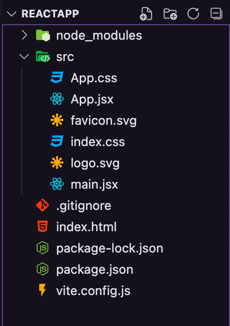

# **<font color=red>ReactJs- Anotações</font>**

Pagina da [Documentação React org](https://pt-br.reactjs.org/) | [create-react-app](https://create-react-app.dev/) | [comunidade React stackoverflow](https://stackoverflow.com/questions/tagged/reactjs)
| [comunidade React dev.to](https://dev.to/t/react?signin=true) | [comunidade React hashnode](https://hashnode.com/n/reactjs) | [comunidade React reddit](https://www.reddit.com/r/reactjs/)

# **<font color=blue>Fundamento React</font>**

### Especializar React

Abertura

### Introdução

Introdução:
O que é ReactJS?
Uma biblioteca JavaScript que tem o objetivo de criação de interfaces.

Porque ReactJS é uma biblioteca e não um framework?
Porque ele não tem uma opinião forte, ele não tem uma estrutura de pastas e regras que os frameworks em si tem. Ele te dá mais liberdade para criar as interfaces da maneira que preferir.

```js
// ssufi Badji@LMDC-1022 MINGW64 ~/Documents/rocketseatIssufiBadji/REACTJS (master)
// $ npm create vite@latest reactapp --template react
// Need to install the following packages:
// create-vite@3.2.1
// Ok to proceed? (y) y
// √ Select a framework: » React
// √ Select a variant: » JavaScript

// Scaffolding project in C:\Users\Issufi Badji\Documents\rocketseatIssufiBadji\REACTJS\reactapp.

// Done. Now run:

// cd reactapp
// npm install
// npm run dev
```

### Criando Projeto

Criando o projeto:
Ao criar um projeto utilizando o ReactJS podemos utilizar os seguintes boilerplates:

Create React App (CRA)
Vite
Quais as vantagens de utilizar Vite ao invés do CRA?

O Vite tem todos os recursos do CRA, mas com melhores implementações e recursos adicionais que o CRA não suporta, com isso o Vite acaba sendo até 10x mais rápido em comparação ao CRA.

Criando o primeiro projeto com o Vite

npm create vite@latest reactapp --template react
Após rodar o comando acima, será exibido a tela para escolher o framework que deseja utilizar.

criando-o-projeto-1

Em seguida, será questionado sobre a variant, escolheremos react que representa que não usaremos o TypeScript nesse projeto.

### Executando Projeto

Executando projeto
Existem duas maneiras de navegar até a pasta do seu projeto, pelo próprio terminal, utilizando o comando cd ou arrastando a pasta do projeto para dentro do VS Code.

Em seguida, será necessário baixar as dependências necessárias para a execução do projeto. Podemos utilizar o npm quanto o yarn como gerenciador de pacotes.

Certifique-se que está na pasta do projeto e execute o comando desejado:

`yarn install`
ou
`npm install`
Após a instalação das dependências, execute o comando abaixo:

Utilize o mesmo gerenciador do comando anterior

`npm run dev`
ou
`yarn dev`
Após executar o comando acima, abra o seu navegador e acesse o endereço:

http://localhost:3000/

E prontinho, seu projeto já estará em execução! 🚀

### Estrutura React



Quando criamos um projeto ReactJS utilizando o Vite, essa será a visualização da nossa estrutura inicial de pastas do nosso projeto.

O arquivo index.html é o principal arquivo do nosso projeto, ele importará o arquivo main.jsx e fará com que o conteúdo seja exibido em nosso navegador.

index.html

```html
<!DOCTYPE html>
<html lang="en">
  <head>
    <meta charset="UTF-8" />
    <link rel="icon" type="image/svg+xml" href="/src/favicon.svg" />
    <meta name="viewport" content="width=device-width, initial-scale=1.0" />
    <title>Vite App</title>
  </head>
  <body>
    <div id="root"></div>
    <script type="module" src="/src/main.jsx"></script>
  </body>
</html>
```

main.jsx

```jsx
import React from "react"
import ReactDOM from "react-dom"
import "./index.css"
import App from "./App"

ReactDOM.render(
  <React.StrictMode>
    <App />
  </React.StrictMode>,
  document.getElementById("root")
)
```

O arquivo main.jsx terá a função de renderizar o componente <App /> e inserir através da DOM do nosso HTML pelo id root.

### JSX

JSX
É uma extensão do JavaScript bem semelhante ao HTML. Basicamente ele é uma sintaxe que o ReactJS utiliza para que possamos criar as nossas interfaces de forma declarativa.

O JSX utiliza funções dentro dos arquivos e o retorno dessas funções retornam tags HTML.

Exemplo de um trecho de código JSX:

App.jsx

```jsx
import { useState } from "react"
import logo from "./logo.svg"
import "./App.css"

function App() {
  const [count, setCount] = useState(0)

  return (
    <div className="App">
      <header className="App-header">
        
        <p>Hello Vite + React!</p>
        <p>
          <button type="button" onClick={() => setCount((count) => count + 1)}>
            count is: {count}
          </button>
        </p>
        <p>
          Edit <code>App.jsx</code> and save to test HMR updates.
        </p>
        <p>
          <a
            className="App-link"
            href="https://reactjs.org"
            target="_blank"
            rel="noopener noreferrer"
          >
            Learn React
          </a>
          {" | "}
          <a
            className="App-link"
            href="https://vitejs.dev/guide/features.html"
            target="_blank"
            rel="noopener noreferrer"
          >
            Vite Docs
          </a>
        </p>
      </header>
    </div>
  )
}

export default App
```

### Estrutura Pastas e Arquivos

### Fragment

03:30

### Importando arquivos CSS

### Separando CSS

### Estilizando Página CSS

### Importando Fonte

### Componentes

### Propriedades

05:25

### Estado

11:02

### Key Prop

### Hooks

### Header

### useEffect

### Consumindo API

### useEffect Async

### Encerramento

```

```
